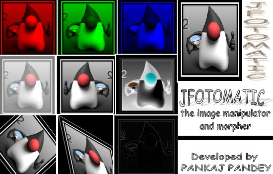

<h1 align="center">
   
  
   
  JFotomatic
   
</h1>

<h4 align="center">Image editor in java with swing gui</h4>

<h1/>

# About
JFotomatic is the first ever project developed by me from scratch. This was the academic project as part of the partial fulfillment of my B. Sc. [Computer Science] degree.

This project was developed using notepad and MS Word for graphics :stuck_out_tongue_closed_eyes:

I haven't followed any design pattern here. I have no plans to redesign this for now.

# Source code restructured for IntelliJ
My buddy Rakesh has tried his best to restructure this mess and the same can be found here -
[Restructure Source code - JFotomatic](https://github.com/racchouhan12/JFhotoMatic)